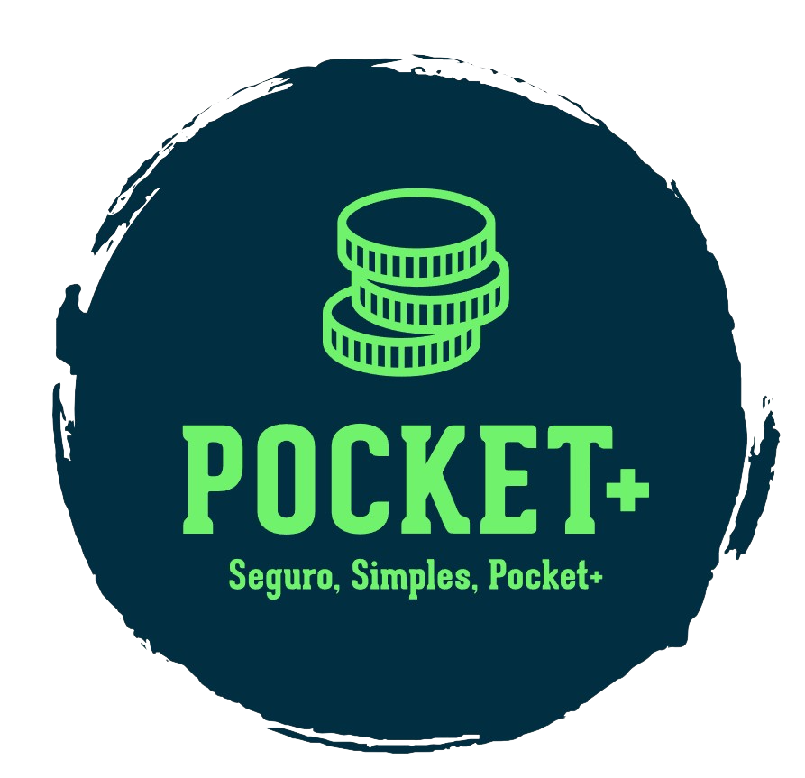

# PI-PocketPlus
Repositório destinado ao projeto do PI do 3° semestre DSM. 

<br id="topo">
<p align="center"> </p>


# POCKET+
Repositório destinado ao Projeto Interdisciplinar do 3º DSM Fatec Franca 2023/2. Alunos: Bruno Vinicius de Laia Silva, Felipe Carvalho Tardivo, Gabriel Araujo de Padua, Marlon Vinicius de Souza

<span id="sobre">
  
## 📘 Sobre o projeto

Nosso Projeto visa atender às nossas necessidades de controle financeiro de modo fácil e dinâmico
focado em débitos e créditos diários onde podemos especificar os gastos do dia ou simplesmente colocar o
total gasto no dia.

<span id="tecnologias">
  
## 🛠️ Tecnologias 

As seguintes ferramentas, linguagens, bibliotecas e tecnologias foram usadas no projeto:
 


<span id="equipe">
  
## 🧑‍💻 Equipe
    
| Função | Nome | LinkedIn & GitHub |
| :-----------: | :------------------------------------ | :-------------------------------------------------------------------------------------------------------------------------------------------------------------------------------------------------------------------------------------------------------------------------------------------------------------------------: |
| Product Owner | Felipe Carvalho Tardivo | [](https://www.linkedin.com/in/felipe-carvalho-tardivo-35b90147/) [](https://github.com/FelipeTardivo)|
| Scrum Master  | Gabriel Araujo de Padua |[](https://www.linkedin.com/in/gabriel-araujo-a7521166/) [](https://github.com/GabrielAraujo989)|
|   Front-End    | Bruno Vinicius de Laia Silva | [](https://www.linkedin.com/in/bruno-vinicius-de-laia-silva/) [](https://github.com/bruuno1994)          |
|   Back-end/DBA    | Marlon Vinicius de Souza |   [](https://www.linkedin.com/in/marlon-vinicius-souza-30417a195/) [](https://github.com/marlon-vinicius)|

# Instruções para rodar a aplicação

## Instalação

1. Clone esse repositório em algum local de sua preferência no seu computador utilizando Git:

```
git clone https://github.com/marlon-vinicius/PI-PocketPlus.git
```

2. Abra dois terminais no projeto e navegue até a pasta do front-end e outra no back-end:

```
cd front-end\pocket-plus
```
```
cd pocketplus-backend
```

3. Instale as dependências do projeto utilizando o NPM nas duas pastas:

```
npm install
```

## Configuração

1. Crie um arquivo `.env` com o código abaixo na raiz do back-end e substitua as variáveis de acordo com sua configuração do banco de dados NoSQL.

```
DATABASE_URL="SEU_DATABASE_MONGO/pocketplus"

JWT_TOKEN = "QUALQUER_PALAVRA"
```

2. No terminal do back-end, rode o código para gerar o prisma

```
npx prisma generate
```

## Execução

Para iniciar a aplicação, execute o seguinte comando na pasta do front-end:

```
npm start
```

E na pasta do back-end

```
npm run dev
```

Isso iniciará a aplicação e o servidor e assim estará disponível para uso.
